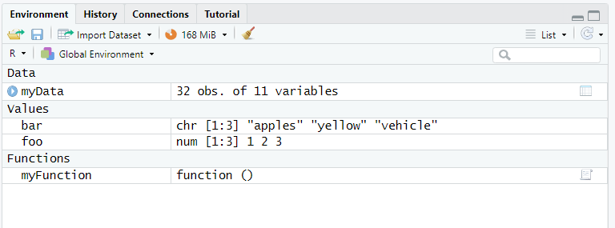
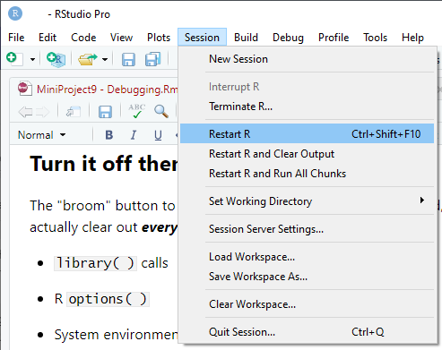

```{r setup, include=FALSE}
knitr::opts_chunk$set(echo = TRUE)
```

## Debugging strategies

1.  Turn it off and turn it on again - clear the environment

2.  Understand the environment - global and local

    1.  Looking at things in the Environment

3.  `debugonce()` , `browser()` and RStudio IDE break points.

4.  `traceback()`, `options(error = recover)`,

Review this video if you get stuck:\
<https://www.youtube.com/watch?v=vgYS-F8opgE>

## A clean Environment is a good thing

Over time your collection of STUFF in R will grow. The problem is that if you don't "spring clean" and tidy things out then eventually something in your collection of objects in R will cause a problem with your current work... You may ***think*** that you are working just with today's data and a vector that you've created, but if something went wrong then maybe you're picking up a version of that object (with the same name) that existed from a previous session. Which is kind of dangerous.

The easiest way to spring clean your R session is to clean out the Environment and restart R.




This will clean out the Environment and start "fresh". REMEMBER TO SAVE ANYTHING YOU MIGHT NEED TO KEEP BEFORE YOU DO THIS!!

For reasons of reproducibility, it's a good idea to start with a "clean" environment whenever you start R or run a script "start to finish" to create output. This will ensure that everything you need to run the script is contained within it, and that you're not relying on objects being present in the Environment to make it run.

When I start an R session, I like to start with this "clean page". If you go to the General tab of the "Global Options" in RStudio IDE there's an option which never reloads existing workspaces (Environment) when you start R and never asks if you would like to save the workspace on exit. If you really want to be clean and tidy (and reproducible) then you should uncheck the "Restore" option and select "Never" for the "Save" option. This ensures that every R session is completely clean when you start it. Every time.


## Turn it off then turn it on again.

The "broom" button to clear the Environment does a lot of good, but it doesn't actually clear out ***everything***. A few things that ***aren't*** removed:

-   `library( )` calls

-   R `options( )`

-   System environment settings i.e. `Sys.setenv( )`

-   attaching datasets with `attach( )`

To make sure that your code is reproducible, you need to ensure that all the libraries you use are referenced / called using `library()` - this is usually done at the top of a script, so that other people can check that the libraries they will need are installed for them.

The way to ***ensure*** that your script is reproducible is to restart R. In the RStudio IDE you can do this from the "Session" menu, or using the shortcut keys CTRL+SHIFT+F10.



This advice to restart R is also particularly true before you install packages (and after!). Installing packages in the middle of an R session is like changing the tires of a bus when it's travelling down the motorway...

If R is behaving "weird" then often it's a good to restart the session and try again...

## Understanding Environments

The Global Environment (which is the collection of objects you see in the panel marked "Environment" in R) is the collection of items that you can look at and use in your R script and R code. But other environments can exist or be created. One place this typically happens is inside a function. Functions have their own environment - so objects you create within a function call (vectors, data) are defined ONLY within the scope of the function.

When you write and run a function, it creates an ***execution environment*** where new objects can be defined and used. But when the function completes, all of those objects are discarded. The purpose of those objects is ***only*** to create the final result to be passed back out of the function.

-   ***Typically, you should ONLY pass the final result object out of a function. DO NOT put objects created in functions into the Global Environment.***

-   ***It is typically bad practice to refer to Global Environment objects within a function UNLESS these are passed in via the function arguments.***

-   ***You should not rely on the person using your function to have specific items in their environment when they call it.***

-   ***It is typically bad practice to change options or set the working directory within a function.***

Let's create a really simple function to illustrate this. Ensure you have cleared the environment using the broom button, or restarted R before you start. Before you run this, what is the result of `myFunction(2)`?

```{r}
myFunction <- function(x){
  a <- 3
  x + a
}

myFunction(2)
```

Now try this code. Before you run it, what is the result of `myFunction(2)`?

```{r}
a <- 4

myFunction(2)
```

And what is the value of `a` now?

```{r}
a
```

## `debugonce()`

How can you "see" the value of `a` within the function?

```{r, eval=FALSE}
debugonce(myFunction)
myFunction(2)
```

When you run this, something weird happens (in fact it's perfectly normal, it's just that you may never have seen this before...).

Look at the Environment now. You'll see that instead of the Global Environment, you're now looking at the environment of the function `myFunction()`. `x` has the value 2.

The Console now has additional buttons showing "Next", "Continue" and "Stop" and some other buttons. The "arrow into { }" means that you want R to step forward INTO the next function. The "arrow with lines" means that you want R to complete the rest of the function. The Console prompt now also says "Browse[2]".

RStudio has also opened the function `myFunction` code in a separate window and there's a little green arrow showing you approximately where you are in the function.\


What you can do from here is to run individual lines in the function, submit commands and create NEW objects (or replace values) in the function Environment.\
If you step through each line of the function, you'll see that the value assigned to `a` is 3 within the function Environment. As you step through each line of the function you can see new objects being defined and used from the Environment associated with the function.

Within the Environment tab in RStudio you can flip between the function Environment `myFunction()` and the `Global Environment` to see how `a` is different inside and outside the function, ***and*** that `a` is defined in two places...

## Inception - down the rabbit hole

If you have a function that calls a function, what does the debug mode show you? Let's define a new function which takes the results of `myFunction` and then squares the result.

```{r}
myFunction_add3_and_squareit <- function(x){
  y <- myFunction(x)
  y*y
}
```

When you run the following code, don't forget to specify `debugonce(myFunction_add3_and_squareit)` at the Console ***first***. Otherwise the code will run all the way through...

```{r}
myFunction_add3_and_squareit(4)
```

You will need to use the button in the debug mode of the Console to "step into" `myFunction` from the `myFunction_add3_and_squareit` function call. This allows you to go deeper down into lower level functions and troubleshoot what is happening at lower levels. VERY useful if you have functions that call functions that call functions. Don't forget: Time goes by much more slowly the deeper you get...

### Don't get trapped in Debug mode!

When the debugger opens you'll be in the special "debug" mode in the Console. This will help you step through the function line by line, or step into lower level functions if your function calls functions... In the image above you can see what the debug console looks like in the bottom left of the picture.

Once you've fixed issues, don't get trapped in the "debug" mode! Notice the "Stop" button (red square) in the Console view. Click on "Stop" to exit "debug" mode and return to your regular R session.

This is a REALLY simple example, but using `debugonce()` and then calling your function is a REALLY great way to find out what's going wrong, as R will set up all the function inputs, arguments etc. for you then drop you inside the function where you can test code, find out EXACTLY what is going wrong with minimal fuss.

## Adding stuff into your code to help debug:

### Keep it simple - `print()`

One easy way to troubleshoot without having to dive into debug mode is just to add `print()` statements to print out objects to the console as the code executes. This allows you to see the contents of an object and check if it makes sense.

I would recommend using `paste()` to identify what is being printed in the Console, i.e. `print(paste("a:",a))`

```{r}
myFunction <- function(x){
  print("Within the function:")
  a <- 3
  print(paste("a:",a))
  print(paste("x:",x))
  x + a
  print(paste("x+a:",x+a))
  print("Result:")
  x+a
}

a <- 4

myFunction(2)
```

Remember to delete the `print()` statements from your function / code once you're finished otherwise your code will become very "chatty"...

### `browser()`

You can insert the `browser()` function into the code of any function you write to automatically drop into this debugging environment in RStudio. This also works when developing Shiny applications. HOWEVER, you have to change the function code to insert the `browser()` function call, and the debugging windows will open EVERY TIME you call the function, UNTIL you remove the `browser()` statement from your function. But it may be useful under certain circumstances where you're trying to debug where there are many levels of functions or complex interactions. Wherever you insert the browser is where R will interrupt the execution and drop into the debugger you see above. So it's possible to skip parts that you know are working OK, and enter debugger around where the error message is...

In the function below, I'm simulating having to wait for execution of upstream code by using the `Sys.sleep` function to wait 15 seconds. THEN the `browser` statement applies and we open the debugger. Note that when the debugger opens, the next line to run is the one AFTER the `Sys.sleep` function call.

```{r, eval=FALSE}
myFunction_add3_and_squareit <- function(x){
  y <- myFunction(x)
  browser()
  y*y
}


myFunction_add3_and_squareit(4)
```

## But what if I'm not using a function?

These debugger methods are really useful for uncovering what is going wrong within a function. If you have issues with code that isn't in a function i.e. you're running a script, then you can still do similar things...

From the RStudio IDE, open the file "MiniProject10_breakpoint_script.R".

On the left-hand side of the Editor, to the left of where the line numbers are, click on line 12. This places a red dot "breakpoint" in the code right where you want to pause and inspect the code from that point.

You ***must*** ***SOURCE*** the code to use the breakpoint functionality - it can't be used in an interactive running of a script.

## `traceback()`

When you get an error in R, you will sometimes see an error at the R Console.

```{r, eval=FALSE}
myFunction_add3_and_squareit("a")
```

Notice that RStudio adds a little button that says "Show Traceback" in the results of the chunk. (R Console does not). In the console you can type `traceback()` to see what steps were run ***before*** the error occured i.e. WHERE did the error occur. Clicking on the "Show Traceback" button in the Rmarkdown chunk output does the same thing.

This doesn't help you in the same was as `debugonce()` does, because in order to get down deep into the function calls, and taking all of your objects with you for debugging is a better way to understand (and fix!) issues, but it's a ***quick*** way to figure out at what point the error occured.

### `recover()` and `options(error = recover)`

Normally when there's an error, R will stop execution, print an error message and (if you're in the RStudio IDE) give you the option of using traceback() to see where things went wrong. But if you specify `options(error = recover)` then instead of dropping out of the function, R will pause exactly where the error occured, allowing you to troubleshoot *in situ***.** What happens is that you have the option to select where in the `traceback()` stack you want to start debugging. If you're using the RStudio IDE you're then in the debug mode we saw with `debugonce()` where you can step through code to find the problem.

```{r, eval=FALSE}
options(error = recover)
myFunction_add3_and_squareit("a")
```

## CHALLENGE

Where is the ***source*** of the error in the `adsl_counts` function below?

```{r, eval=FALSE}
adsl_counts <- function(dataFile) {
  
 adsl_saf <- dataFile %>%
    filter(SAFFL == "Y")
  
  Big_N_cnt <-  adsl_saf %>%
    group_by( TRT01AN, TRT01A  ) %>%
    summarise(N = n())

  small_n_cnt <- adsl_saf %>%
    group_by( TRT01AN, TRT01A,  SEX ) %>%
    summarise(name = "n")

  adsl_mrg_cnt <- small_n_cnt %>%
    left_join(Big_N_cnt, by = c("TRT01AN","TRT01A")) %>%
    mutate(perc = round((n/N)*100, digits=1)) %>%
    mutate(perc_char = format(perc, nsmall=1)) %>%
    mutate(npct = paste(n, 
                        paste0( "(", perc_char, ")" ) 
                        ) 
           ) %>%
    mutate(SEX = recode(SEX, 
                        "M" = "Male",
                        "F" = "Female")) %>%
    ungroup() %>%
    select(TRT01A, SEX, npct) %>%
    pivot_wider(names_from = TRT01A, values_from = npct) 
  
  return(adsl_mrg_cnt)
}

library(rio)
library(tidyverse)

inFile <- "https://github.com/phuse-org/phuse-scripts/raw/master/data/adam/cdisc/adsl.xpt"

adsl <- import(inFile)

adsl_counts(dataFile = adsl)
```

## Extra Credit

What would you need to do to fix the code above?
