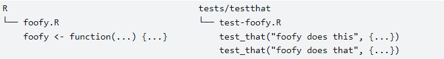

`{testthat}` is a new package we will be using in this project. Please install before beginning this exercise.

```{r setup, include = FALSE}
knitr::opts_chunk$set(echo = TRUE)

library(tidyverse)
library(rio)
library(testthat)
```

## Introduction

In this Mini-Project we'll look at how to test your code in R. Testing your code can be painful and tedious, but it greatly increases the quality of your code. It ensures that your code does what you want it to do while also providing testing documentation.

## Benefits of testing

While developing functions in R, programmers usually do informal testing. After you wrote the function, you most likely test it in the console by running it on the set of data and comparing the result with the expectation. This approach is good for informal testing while developing code, but it becomes problematic if you need to add new functionality to your code a month or two later and there is no record of the tests you performed. This makes it very easy to break code that used to work.

What about a more formal QC process? Once you have written R code, you might ask a colleague to independently QC the functions you have created to make sure are correct by testing them with a few examples. The approach is valid and gets the job done however, there are a few questions:

-   How would you ensure the code performs as expected in cases when the human reviewer is not available?

-   How will you ensure that the changes you made to a different part of the code later on didn't affect the code that was already QCed and tested?

-   How should the reviewer document the testing?

All these questions can be addressed with **automated testing** (also known as automated **unit testing**). Unit testing allows us to check the correct behavior of a unit of code, which, in the context of R, translates to the correct behavior of a function.

Automated unit testing advantages:

-   Saves time and effort, and helps with debugging.

-   Helps to ensure the code performs as expected in cases when the human reviewer is not available.

-   You can rerun your tests every time any part of the code changes to ensure that the new code didn't affect previously set functionality and expectations.

-   The tests themselves provide documentation for the code.

... **and it forces you to write testable code** thus improving the overall code design.

## Writing testable code

If you are struggling to write tests, take it as a hint that the problem might lie in the design of your function(s). **A good function has one main task that it performs** that then is getting tested.

In the MiniProject7, we discussed that good functions should be easy to read, review, and improve. It is also easier to test and debug a function that has **one main task it performs**. Remember how in section *`6. Review and refactor. Often.`* of the MiniProject7 our function took a data location path and did everything from reading the SAS dataset to producing the table content? A function like this would be harder to test since it is performing two actions: reading the data in and wrangling it. In that exercise, we were able to simplify things after we updated the function to ***only*** produce the summarized counts using the data that was read in outside the function. This improved function's speed and made it more suitable for testing.

## Automated testing with {testthat}

**{testthat}** is the most popular unit testing package for R and is primarily used for testing R packages, however you can use its neat functionality when developing your own code even if you don't want to wrap it up in a package.

## Expectations

An **expectation** is the finest level of testing and it allows us to assert that the values returned by a function match the ones we should get. It describes the expected result of a computation: Does it have the right value and right class? Does it produce an error when it should? An expectation automates visual checking of results in the console. Expectations are functions that start with `expect_`.

The developer should test valid inputs, invalid inputs, errors, exceptions, events, and everything that has a potential to break.

There are a [great number of expectation functions](https://testthat.r-lib.org/reference/index.html) in the {testthat} package. The examples of questions they answer are:

-   Does code return the expected value? [`expect_equal()`](https://testthat.r-lib.org/reference/equality-expectations.html) [`expect_identical()`](https://testthat.r-lib.org/reference/equality-expectations.html)

-   Does code return a vector with the specified length? [expect_length()](https://testthat.r-lib.org/reference/expect_length.html)

-   Does code return a number greater/less than the expected value? [`expect_lt()`](https://testthat.r-lib.org/reference/comparison-expectations.html) [`expect_lte()`](https://testthat.r-lib.org/reference/comparison-expectations.html) [`expect_gt()`](https://testthat.r-lib.org/reference/comparison-expectations.html) [expect_gte()](https://testthat.r-lib.org/reference/comparison-expectations.html)

-   Does code return `TRUE` or `FALSE`? [`expect_true()`](https://testthat.r-lib.org/reference/logical-expectations.html) [`expect_false()`](https://testthat.r-lib.org/reference/logical-expectations.html)

-   Does code throw an error, warning, message, or other condition? [`expect_error()`](https://testthat.r-lib.org/reference/expect_error.html) [`expect_warning()`](https://testthat.r-lib.org/reference/expect_error.html) [`expect_message()`](https://testthat.r-lib.org/reference/expect_error.html) `expect_condition()`

...and so many more!

Testing is **a very broad topic** and we won't be able to cover everything in this mini-project. The main objective is to grasp the idea of testing and get familiar with the {testthat} package.

## Writing testable code - example

Now that we discussed benefits of testing and learned about the {testthat} package, let's take a look at few functions we are going to work with today. The first function we are going to test is `wrangle_data()` function. It takes one argument - data. Then, it loads, filters, and subsets the data using and returns `adsl_data` object.

```{r}

library(testthat)

# Create wrangle_data function
wrangle_data <- function(data) {
  adsl_data <- adsl_data %>%
    filter(SAFFL == "Y") %>% 
    select("STUDYID", "USUBJID", "SEX", "TRT01A", "TRT01AN", "SAFFL")
  return(adsl_data)
}
```

Now, let's take a look at the `adsl_counts()` function that we worked with in Mini Project 7 (its simplified version). This function will take the **output** of the `wrangle_data()` function and take it as **input.** Notice that the `adsl_counts` function is doing a few things:

-   First it creates an object `Big_N_cnt` that holds total count of occurrences by treatment group

-   Then it creates an object `small_n_cnt` that holds total count of occurrences by treatment group and sex

-   And then it leverages `Big_N_cnt` and `small_n_cnt` to create `adsl_mrg_cnt` tibble that is using these two objects to calculate the percentage.

```{r}

adsl_counts <- function(adsl_data) {
  
  Big_N_cnt <-  adsl_data   %>%
    group_by( TRT01AN, TRT01A  ) %>%
    count(name = "N")
  Big_N_cnt
  
  small_n_cnt <-  adsl_data  %>%
    group_by( TRT01AN, TRT01A,  SEX ) %>%
    count(name = "n")
  small_n_cnt
  
  adsl_mrg_cnt <- small_n_cnt %>%
    left_join(Big_N_cnt, by = c("TRT01A", "TRT01AN")) %>%
    mutate(perc = round((n/N)*100, digits=1)) %>%
    ungroup() %>%
    select(TRT01A, SEX, perc)
  
  adsl_mrg_cnt
}

```

Functions like this may be harder to debug and test because there are dependencies inside the function e.g. `adsl_mrg_cnt` step will fail if `small_n_cnt` or `Big_N_cnt` are not computed or produce unexpected result.

With that in mind, let's break our big function into three smaller one so that we can test each one individually. We will call these functions `calculate_Big_N_cnt`, `calculate_small_n_cnt` , and `adsl_counts`.

First, we will create a function `calculate_Big_N_cnt` that takes in `adsl_data` argument and `returns` the `Big_N_cnt`

```{r}

calculate_Big_N_cnt <- function(adsl_data) {
  Big_N_cnt <-  adsl_data   %>%
    group_by( TRT01AN, TRT01A ) %>%
    count(name = "N")
  return(Big_N_cnt)
}
```

Now add some code to turn the lines of code below into the `calculate_small_n_cnt` function that takes in `adsl_data` argument. Remember to `return()` the `small_n_cnt.`

```{r}

  small_n_cnt <-  adsl_data  %>%
  group_by( TRT01AN, TRT01A,  SEX ) %>%
  count(name = "n")
  small_n_cnt

```

And now let's transform the code below into the `adsl_counts`function. Remember, this function will take the output of the two functions above as arguments.

```{r}
 

  adsl_mrg_cnt <- small_n_cnt %>%
    left_join(Big_N_cnt, by = c("TRT01A", "TRT01AN")) %>%
    mutate(perc = round((n/N)*100, digits=1)) %>%
    ungroup() %>%
    select(TRT01A, SEX, perc) 
  
  adsl_mrg_cnt


```

## Writing tests

Now let's test our functions! We are going to use the `expect_` functions described above to assist us with testing. We are going to test the input, output data for our functions and confirm that the calculations that our functions perform are correct.

First, let's write some tests for our `wrangle_data()` function. For our test data we are going to use the\
CDISC ADaM data published by PHUSE organization (`adsl_data` is already loaded into our environment). The rule of thumb is to use different data for testing than the data you are using to run the production code. The data should also be well controlled. In this case, the ADSL data format is standardized coming from a reliable source. The `wrangle_data()` function is doing a couple of transformations (it filters and subsets the data) and we want to test for unexpected **output**.

Certain tests will require us to create additional test data to test certain functionality, but we will discuss this once we get there.

Let's take a look at the data.

```{r}
#Read in PHUSE data
phuse_data <- rio::import("https://github.com/phuse-org/phuse-scripts/raw/master/data/adam/cdisc/adsl.xpt")

head(phuse_data)

```

Now let's take a look at the function's output when it is applied to the data.

```{r}

# Create wrange data function
wrangle_data <- function(adsl_data) {
  adsl_data <- adsl_data %>%
    filter(SAFFL == "Y") %>% 
    select("STUDYID", "USUBJID", "SEX", "TRT01A", "TRT01AN", "SAFFL")
  return(adsl_data)
}

adsl_data <- wrangle_data(phuse_data) 
adsl_data
```

We expect that the **output** of `wrangle_data()` will have total of six columns and the `"SAFFL"` column will only contain `"Y"` values since this is what we are filtering on.

We will use [`expect_equal()`](https://testthat.r-lib.org/reference/equality-expectations.html) test to confirm that the returned `SAFFL` column only contains `Y` values and that there are no `NA` values present in that column. The `expect_equal(object, expected)` function takes two arguments: *object* (computation)*, expected* (value to compare it to).

In the first test, we are using the `unique()` function to determine a unique values in the `adsl_data$SAFFL` column which we expect to be `Y` hence the second argument of the `expect_equal()` function.

Notice that running the `expect_equal()` test below does not give you the output and that's expected in cases when you run individual tests that pass. You'd get the output if your test produces the error or if you group several expectations that test a function or a feature.

```{r}
# Assign wrangle_data() output to the adsl_data object
adsl_data <- wrangle_data(phuse_data)

# Create a test
expect_equal(unique(adsl_data$SAFFL), "Y")
```

In the second test below, we are using `is.na` and `sum` functions to confirm that there are no missing values in the `adsl_data$SAFFL` column. We learned from the *MiniProject8 - applying functions* that with the help of `is.na` function R evaluates whether the values in the SAFFL variable are missing, creating `TRUE` or `FALSE` for every observation simultaneously. Then we're taking the sum of those values where `TRUE` = 1 and `FALSE` = 0. This gives the number of missing values in the column which in our case we expect to be 0.

```{r}
expect_equal(sum(is.na(adsl_data$SAFFL)), 0)

```

Let's also create a test for the expectation that our output data set should only contain 6 columns [`expect_length()`](https://testthat.r-lib.org/reference/expect_length.html) .

```{r}
expect_length(names(adsl_data), 6)

```

**{test_that}** allows us to group several expectations that test a function or a feature. In order to group the expectations, we need to use `test_that(desc, code)` shown below to name each expectation. The naming will allow us to identify any failing test more easily.

Run the code below, look at the error and fix it accordingly. Notice how user-friendly the error is!

```{r}
test_that("wrangle_data() output is correct", {
  adsl_data <- wrangle_data(adsl_data)
  
  expect_success(expect_equal(unique(adsl_data$SAFFL), "Y"))
  expect_success(expect_equal(sum(is.na(adsl_data$SAFFL)), 0))
  expect_success(expect_length(names(adsl_data), 5))
})
```

If the function is performing correctly we expect all three tests to succeed so we can also wrap each test up into [`expect_success()`](https://testthat.r-lib.org/reference/expect_success.html) function. We can also use `expect_failure()` functions to test our expectations and catch errors. We expect `expect_equal()` below to fail if there are "N" values in the output data SAFFL column.

```{r}
expect_failure(expect_equal(unique(adsl_data$SAFFL), "N"))
```

We also have to remember that the **output** of the `wrangle_data()` function will become an **input** for the `calculate_Big_N_cnt()` and `calculate_small_n_cnt()` and it is important to ensure that **input** data for these functions will meet the expectations otherwise the whole pipeline will break.

Now let's create a test to confirm that the `wrangle_data()` **output** (`adsl_data` object) which is going to be an ***input*** for the `calculate_Big_N_cnt()` and `calculate_small_n_cnt()`functions contains expected column names as these functions expect certain columns to be present in the data. To help us test that, let's create a vector with expected names called `expected_vars`

```{r}
expected_vars <- c("TRT01AN", "TRT01A", "SEX")
```

We can check if "TRT01AN" "TRT01A", and "SEX" column names are present in the data using the `%in%` operator. The code below compares two vectors: the `expected_vars` we created above and the vector of the column names in the `adsl_data` output. R is evaluating whether the values in the `expected_vars` variable are present in the `names(adsl_data)`, creating `TRUE` or `FALSE` for every observation in `expected_vars`. As we learned above and from *MiniProject8*, we can take the sum of those values where `TRUE` = 1 and `FALSE` = 0.

```{r}
sum(expected_vars %in% names(adsl_data))
```

When running the code, we received a value of `3` which is what we would expect if all three columns are present in the data. Now, let's use the `expect_equal()` function to write the test. Complete the test code below setting the expectation.

```{r}
test_that("expected columns are all present in the wrangle_data() output", {
  expect_equal( , )

})
```

Great! Now that we created tests to check the inputs and outputs of the `wrangle_data()` function, let's take a look at testing the `calculate_Big_N_cnt()` and `calculate_small_n_cnt()` functions.

So far, we've been using test PHUSE data set to facilitate testing expectations specific to ADSL data e.g column names or certain expectations that could be easily verified. However, you might not have reliable test data available on hand or the one you have might not be easy to use to test certain expectations. It is very common to create your own test data, especially if you need to test particular computations.

For testing `calculate_Big_N_cnt()` and `calculate_small_n_cnt()` functions we will create our own test data that mimics `adsl_data` output, but easier to manage.

```{r}
test_data <- tribble(
 ~STUDYID,  ~TRT01AN,   ~TRT01A,       ~SEX,    ~SAFFL, ~USUBJID,
 "CDISCPILOT01",    1,     "Treatment A",  'Female',  "Y",   "01-701-1015", 
 "CDISCPILOT01",    1,     "Treatment A",  'Male',    "Y",   "01-701-1023",
 "CDISCPILOT01",    2,     "Treatment B",  'Female',  "Y",   "01-701-1180",
 "CDISCPILOT01",    1,     "Treatment A",  'Male',    "Y",   "01-701-1138",
 "CDISCPILOT01",    1,     "Treatment A",  'Female',  "Y",   "01-702-1145",
 "CDISCPILOT01",    2,     "Treatment B",  'Male',    "Y",   "01-702-1180",
 "CDISCPILOT01",    2,     "Treatment B",  'Female',  "Y",   "01-703-1558",
 "CDISCPILOT01",    1,     "Treatment A",  'Male',    "Y",   "01-703-1678",
)

view(test_data)
```

The `calculate_Big_N_cnt()` function creates `Big_N_cnt` tibble ***output*** that is expected to **only** have three columns: `"TRT01AN"`, `"TRT01A"`, and `"N"`. In this case we can use the [`expect_named()`](https://testthat.r-lib.org/reference/expect_named.html) function that will match the exact number of columns and their names in the object to the expected character vector.

Note that in the test example above we created a named vector and in this example below we used an unnamed vector to store the expected names. These both are valid approaches. The rule of thumb is if you are going to reuse the same vector repeatedly, it is better to store it as a separate object and if you are going to reuse it across multiple test files, store it in a separate file. We will discuss this more in detail down below in the ***Organize and run your tests*** section.

```{r}
test_that("expected columns are all present in the calculate_Big_N_cnt() output", {
expect_named(calculate_Big_N_cnt(test_data), c("TRT01AN", "TRT01A", "N"))
})
```

What else do we expect for the `calculate_Big_N_cnt()`**output** data? We know exactly what dimensions it should have. It should always have three columns and the number of rows corresponding to the number of treatment groups. We can set this expectation using `expect_equal(object, expected)` function.

For the first `object` argument of `expect_equal()` we are going to use `dim()`. The `dim()` function gives us a vector of two numbers (number of rows and number of columns in the `calculate_Big_N_cnt()` output object).

```{r}
dim(calculate_Big_N_cnt(test_data))
```

For the second `expected` argument of `expect_equal()`we are going to use a vector of two values:

The first value is the number of rows corresponding to the number of treatment groups in the output data set. We will use `unique()` function to determine a unique number of treatment groups and `length()` to count the groups. Using these functions instead of hardcoding the number of rows will ensure that our test code will work for any other test data if needed, not only the one we are working with right now.

The second value can be hard-coded since we will always expect 3 columns in the output dataset.

```{r}
c(length(unique(calculate_Big_N_cnt(test_data)$TRT01A)), 3)

```

Now we are ready to combine these two arguments together into the test `expect_equal()` test:

```{r}
test_that("calculate_Big_N_cnt() output has expected dim, columns, and types", {
  expect_equal(dim(calculate_Big_N_cnt(test_data)), c(length(unique(calculate_Big_N_cnt(test_data)$TRT01A)), 3))
})


```

Let's not forget about the `calculate_small_n_cnt` function that we created earlier and set some expectations for the data **outputs** for that function as well. Complete the functions below to have correct expectations for the `small_n_cnt` output that is returned by the function. Remember, the `small_n_cnt` object returns more columns and rows than its `Big_N_cnt` counterpart. You'll also get twice as many rows since treatment groups are divided by sex as well.

```{r}
test_that("calculate_small_n_cnt() output has expected dim, columns, and types", {
   expect_named( , )
   expect_equal( , )
})

```

Now let's gather all tests we created so far and put them all together. Remember, we can combine all relevant tests together and update the test_that description accordingly. Add your `calculate_small_n_cnt` set of tests here as well.

```{r}

test_that("wrangle_data() output has expected dimentions and values", {
  expect_success(expect_equal(unique(adsl_data$SAFFL), "Y"))
  expect_success(expect_equal(sum(is.na(adsl_data$SAFFL)), 0))
  expect_success(expect_length(names(adsl_data), 6))
  expect_equal(sum(expected_vars %in% names(adsl_data)), 3)
})


test_that("calculate_Big_N_cnt() output has expected dim, columns, and types", {
  test_Big_N_cnt <- calculate_Big_N_cnt(test_data)
  
  expect_named(test_Big_N_cnt, c("TRT01AN", "TRT01A", "N"))
  expect_equal(dim(test_Big_N_cnt), c(length(unique(test_Big_N_cnt$TRT01A)), 3))
  expect_type(test_Big_N_cnt$N, "integer")
})

```

Did you notice that the second set of tests has the [`expect_type()`](https://testthat.r-lib.org/reference/inheritance-expectations.html) that we didn't go cover earlier? This function is pretty self-explanatory and it is a very helpful and important function to know if your code depends on the particular input/output data types that come in and come out of the function.

Now, let's talk about setting expectations for `calculate_small_n_cnt()` and `calculate_Big_N_cnt()` **computations** since we need to create tests to check if the values in the `small_n_cnt` and `Big_N_cnt` outputs are calculated as expected. For that, we will again use our `test_data` since it will be very easy to check if the computations are performed correctly on a smaller set of data.

```{r}
test_data

```

`calculate_Big_N_cnt()` counts a number of occurrences per Treatment group so looking at the `test_data`, we can easily determine that we should get N=5 for "Treatment A" and N=3 for "Treatment B" when we apply `calculate_Big_N_cnt()` **IF** our function works as expected. Let's write a test and see if out function passes the test.

We first will apply the function to a test data and assign it to an object `test_Big_N_cnt` and then use `expect_equal` function to see if our assumption is correct.

```{r}

test_that("calculate_Big_N_cnt() produces correct calculation", {
test_Big_N_cnt <- calculate_Big_N_cnt(test_data)

expect_equal(test_Big_N_cnt$N, c(5,3))
})
```

Let's test the same expectation for the `calculate_small_n_cnt()` taking into account that it counts occurrences per treatment per group. Note, R sorts alphabetically by default unless specified otherwise.

```{r}

test_that("calculate_small_n_cnt() produces correct calculation", {
test_small_n_cnt <- calculate_small_n_cnt(test_data)

expect_equal(head(test_small_n_cnt$n, 2), c(2,3))
})

```

We also expect that when we make a sum of small n values by sex per treatment they will have the same values as the big N so let's write the test. Let's take a look at the `test_small_n_cnt` (the `calculate_small_n_cnt(test_data)` output) to remind us of its structure.

```{r}
test_small_n_cnt <- calculate_small_n_cnt(test_data)
test_small_n_cnt  

```

In order to calculate the sum of `n` values by sex per treatment, we can use the `aggregate()` function. The `aggregate()` function in R splits the data into subsets, computes specified summary statistics for each subset, and returns the result in a group by form. In the console below type `?aggregate` and take a look at the description of the `x`, `by`, and `FUN` arguments we are using below. We will need to assign the result of the `aggregate()` function to a new `aggregate_small_n_cnt` variable that we are going to use in the test.

```{r}
aggregate_small_n_cnt <- aggregate(x = test_small_n_cnt$n, by=list(TRT01A=test_small_n_cnt$TRT01A), FUN=sum)

aggregate_small_n_cnt

```

`aggregate()` is a base R function that fits great for this purpose however, we could use `group_by()` and `summarize()` functions from the {[dplyr](https://dplyr.tidyverse.org/index.html)} package as an alternative to get the same result. Run the code below to confirm that it produces the same result as the output of the `aggregate()` function. It is important to note that there are multiple ways to approach the same task in R. Numerous R packages, base R functions, and a combination of both provides a wide range of solutions.

```{r}
aggregate_small_n_cnt <- test_small_n_cnt %>% group_by(TRT01A) %>% summarize(x = sum(n))
aggregate_small_n_cnt
```

Now we have a new `aggregate_small_n_cnt` object with column `x` that we expect to contain the same values that column `N` of the `calculate_Big_N_cnt(test_data)` output contains. Let's check if our results are identical. For that we will use the `expect_identical` function.

```{r}

test_that("big n and summarized small n are identical", {
  aggregate_small_n_cnt <- aggregate(
    x = test_small_n_cnt$n, 
    by=list(TRT01A=test_small_n_cnt$TRT01A), 
    FUN=sum)
  
  test_Big_N_cnt <- calculate_Big_N_cnt(test_data)
  
  expect_identical(aggregate_small_n_cnt$x, test_Big_N_cnt$N)
})  
```

Great! Now we accounted for quite a few situations that could go wrong and it will be easier for us to debug the code as the tests will tell us exactly where the error lies if certain tests don't pass.

Remember, **we only scratched the surface of testing** your data and there are so many more cases, packages, tutorials, and great examples out there! Here are just a few:

-   [R Packages: Testing Basics](https://r-pkgs.org/testing-basics.html)

-   [testthat: Get Started with Testing](https://journal.r-project.org/archive/2011-1/RJournal_2011-1_Wickham.pdf)

-   [Getting started with unit testing in R](https://www.pipinghotdata.com/posts/2021-11-23-getting-started-with-unit-testing-in-r/)

-   [{shinytest2}: Unit testing for Shiny applications](https://www.rstudio.com/conference/2022/talks/shinytest2-unit-testing-for-shiny/)

-   <https://www.r-bloggers.com/2019/11/automated-testing-with-testthat-in-practice/>

-   [Test Coverage for Packages • covr](https://covr.r-lib.org/)

## Organize and run your tests

**{testthat}** works best within the package workflow as you get some of the setup benefits "for free", however you don't have to create a package to utilize {testthat}, but there are a few rules you need to follow to make your testing experience seamless.

Your folder structure should look like this:



You should keep your all your R scripts organized in folder named `R`, and all your tests in `test/testthat` folder. Note that testthat tests **must** live in files below `tests/testthat/` and these file names **must** begin with `test`. The test file name is displayed in testthat output, which provides helpful context.

When downloading (cloning) this MiniProject12, you also downloaded (cloned) the *MiniProject12_Example* folder along with it. Inside the *MiniProject12_Example* folder, you'll find the example of how the testing structure should be set up. You can browse the folder and check out the files structure and contents. The folder also contains the *Example.Rproj*. If you double-click on the project, it will open a new R session with preconfigured directory settings that will allow you to run the tests. Once you opened the *MiniProject12_Example.Rproj*, go to the `tests/testthat/testthat.R` and run the script. You'll see the test details in the console. Once you finished exploring, go to the upper right corner of the RStudio IDE and click "Close Project".


## Challenge

We still have `adsl_counts()` that we need to test! Explore the function and create tests to test if the `perc` values calculated correctly. Think of other data transformations that happen within the function and write tests to catch unexpected inputs/outputs, errors.

```{r}

# Create calculate_Big_N_cnt function
calculate_Big_N_cnt <- function(adsl_data) {
  Big_N_cnt <-  adsl_data   %>%
    group_by( TRT01AN, TRT01A ) %>%
    count(name = "N")
  return(Big_N_cnt)
}

# Create calculate_small_n_cnt function
calculate_small_n_cnt <- function(adsl_data) {
  small_n_cnt <-  adsl_data  %>%
    group_by( TRT01AN, TRT01A,  SEX ) %>%
    count(name = "n")
  return(small_n_cnt)
} 

# Create adsl_counts function 
adsl_counts <- function(adsl_data, Big_N_cnt, small_n_cnt) {
  
  adsl_mrg_cnt <- small_n_cnt %>%
    left_join(Big_N_cnt, by = c("TRT01A", "TRT01AN")) %>%
    mutate(perc = round((n/N)*100, digits=1)) %>%
    mutate(SEX = recode(SEX, 
                        "M" = "Male",
                        "F" = "Female")) %>%
    ungroup() %>%
    select(TRT01A, SEX, perc)
  
  return(adsl_mrg_cnt)
}

# Compute the result
Big_N_cnt <- calculate_Big_N_cnt(test_data)
small_n_cnt <- calculate_small_n_cnt(test_data)

# Apply adsl_counts() function 
adsl_test_data <-  test_data %>% 
  adsl_counts(., Big_N_cnt, small_n_cnt)

adsl_test_data
```

```{r}
# TODO Create test cases for adsl_counts()

```

## 
