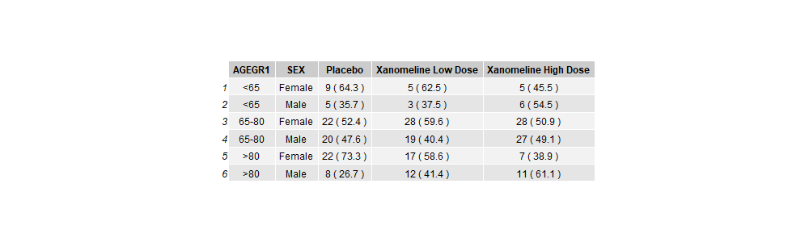

# Build familiarity with R coding & generate Counts and Percentages of categorical variables by Gender

In this project we are working towards creating a demography summary table like this one: .a

Ours won't look exactly like this, but we will be trying to mimic the structure of this table. 

## Aims:

-   Read in ADSL SAS (xpt) dataset

-   Subset for Efficacy Analysis Population

-   Count observations within grouping variables and calculate percentages of total N

-   Transpose the resulting data to prepare for tabulation

## How to use this document:

In this document you'll see code chunks (typically on a light grey background) and text. This is an example of an "Rmarkdown" document. You can write and run code within the document and the results will be presented underneath each code chunk. You should follow the instructions as written in the text, amending the code chunks, then running them to produce the outputs as instructed.

## Data Source
For these projects we are using anonymized CDISC datasets, which can be found here:
https://github.com/phuse-org/phuse-scripts/tree/master/data/adam/cdisc 

## R objects and functions

Within R we typically use objects of different types e.g. data, vectors, lists etc. and then we apply functions. Functions have the construct `<function_name>(<argument1>=   , <argument2> = )`. When you use functions, you don't ***have*** to use the argument name and instead you can implicitly refer to the arguments by position e.g. `myFunction(foo, 1, "bar")` passes in the R object `foo` as the value for argument 1; argument 2 takes the value `1` and argument 3 takes the character value `"bar"`. While you're learning R we recommend that you explicitly name and use the arguments in functions, except where functions only have one argument. You can use the tab-completion in the RStudio IDE to help complete function call arguments. To see the arguments of a function type `?<functionName>` in the Console.

## Start the mini project

1.  The following steps will load the packages `tidyverse`, `rio`, `skimr` and `htmlTable`. You need to load packages before using the functions and content in them, and it's best to do so at the beginning of a program / script. Run the chunk below by clicking on the green arrow to the right of the code chunk.

```{r setup}
library(tidyverse)
library(rio)
```

2.  Read in the CDISC adsl data from the GitHub location (`https://github.com/phuse-org/phuse-scripts/raw/master/data/adam/cdisc/adsl.xpt`) and assign this to an object in R using the assignment operator `<-`. Make sure that the URL location is a character string by enclosing it in `" "`. The `rio` package has a function called `import` that reads data into R and infers the data type from the file name. The first argument of that function is `file`. Paste the file path / URL above after the `file=` argument in the code below, then run the chunk using the green arrow.

```{r read_adsl_data}
adsl <- import( file = ""  )
adsl
```

Note that the `adsl` data object has 254 rows and 48 columns.

Now create a new data object `adsl_eff` for Efficacy Analysis population. We need to filter the `adsl` data object where the variable `EFFFL` has the value `Y`. Answer the question below and paste the correct answer into the code chunk.

------------------------------------------------------------------------

QUICK QUIZ: Which of the following options will filter the data where the variable EFFFL has the value `Y`?

-   filter(.data = adsl, EFFFL = Y)
-   filter(.data = adsl, EFFFL == "Y")
-   filter(.data = adsl, "EFFFL" == "Y")
-   filter(.data = adsl, EFFFL = "y")

(HINT: We also did this task in MiniProject 1)

If you are unsure, try each option by pasting in the filter statement after the assignment `<-` in the code chunk below.

------------------------------------------------------------------------

```{r create_adsl_saf}
adsl_eff <-   adsl %>%
  filter(  )
adsl_eff
```

After filtering out the data we now have 234 rows and 48 columns.

Again, recall that R is case-sensitive. Most variable names in SAS datasets are uppercase, so we need to ensure that the variable name is UPPERCASE i.e. `EFFFL` and not `Efffl` etc. Also, since the value is character, we need to ensure that the case of the equivalent value matches the expected result i.e. `Y` and not `y` or `Yes` and that it is enclosed in quotes `" "`.

DEFENSIVE PROGRAMMING in R: If you're dealing with data where you can't guarantee that the value is upper case or lower case, then it's a good idea to convert the values to uppercase before you compare using the `casefold()` function wrapped around the variable name i.e. `casefold(EFFFL, upper=TRUE) == "Y"`

3.  Calculate the marginal totals (N) - count the number of individuals in each treatment group.

Next we need to count and save the marginal totals (big N) to act as the denominator for the calculation of the percentage of observations in each table cell = n/N \* 100%

In the R chunk below, we start with the `adsl_eff` dataset and count the number of observations in each level of the variables specified in the `group_by()` function.

> ***R for SAS users:*** The `group_by()` function works a lot like a `BY ;` statement in SAS. Everything you do after a `group_by()` will be done for ***each level*** of the variables within the `group_by()`.

In the next code chunk we want to calculate the number of observations within each level of the treatment variable `TRT01A`. The {dplyr} package has a function called `count()` that will do just that. Add the treatment variable `TRT01A` to the `group_by()` function in the code below to calculate the number of observations for each treatment group.

```{r group_by}
adsl_eff %>%
  group_by( ) %>%
  count(name = "N")
```

What happens if you comment out the group_by() statement in the code above? (HINT: Comment out code using `#` at the start of the line to be commented, or place the cursor on the line / highlight the line and use the shortcut CTRL+SHIFT+C).

Whenever you use `group_by()` R will carry along the grouping variables into the output. In this example, it's useful to have both the numeric value for the treatment in period 1 `TRT01AN` ***and*** the label `TRT01A`. This is because we will want to use the numeric value for sorting, and the label for printing in the final table. Notice in this case since there is a 1:1 relationship between `TRT01AN` and `TRT01A` we get the same answer as before.

```{r big_N}
Big_N_cnt <- adsl_eff %>%
  group_by(   ) %>%
  count(name = "N")
Big_N_cnt
```

4.  Next we want to calculate the "small n" counts within each category of the `SEX` variable ***within*** each treatment arm.

    If we add the additional variable into the `group_by()` then we calculate the count of observations for each unique combination of the levels of those variables. Let's amend the code above to add the variable `SEX`.

```{r small_n}
small_n_cnt <- adsl_eff %>%
  group_by( TRT01AN, TRT01A,  ) %>%
  count(name = "n")
small_n_cnt
```

Do we get different answers if we use the `group_by()` variables in a different order?

```{r change_group_order}
adsl_eff %>%
  group_by(  ) %>%
  count(name = "n")
```

No. But the order of variables in columns in the output is changed.

5.  Merging "Big_N\_cnt" and "small_n\_cnt" before calculating percentages...

The {dplyr} package gives R users "SQL-like" functionality to join or filter two datasets / tables using a variety of methods: `left_join`, `right_join`, `inner_join`, `full_join`, `anti_join`, `semi_join`. (See <https://dplyr.tidyverse.org/articles/two-table.html> for more details). If you know `PROC SQL` then this will be quite familiar.

In the next step we're going to use `left_join` to combine the left hand dataset - `small_n_cnt` with the right hand dataset `Big_N_cnt`. This will ensure that all entries from the left hand dataset are present in the resulting data object. A little bit of care is required to think about which dataset should be on the left, and which on the right...

```{r left_join}
adsl_mrg_cnt <- small_n_cnt %>%
  left_join(Big_N_cnt)
adsl_mrg_cnt
```

Notice that rows in `Big_N_cnt` that have matching `TRT01A` and `TRT01AN` are matched to rows in `small_n_cnt` and repeated if necessary. By default the `<>_join` functions of {dplyr} will try to match on variable names that exist in both datasets.

If you *need* to, you can explicitly define which variables to join by, and identify the joining variables in each dataset:

```{r}
small_n_cnt %>%
  left_join(Big_N_cnt, by = c("TRT01A", "TRT01AN"))
```

For more information on joining data, see this vignette: <https://dplyr.tidyverse.org/articles/two-table.html>

6.  Calculate percentages for treatment group `TRT01A` split by `SEX`.

For this step, we want to create a new column in the `adsl_mrg_cnt` dataset containing the percentage of observations (subjects in the trial) from each `SEX` within each treatment group given by `TRT01A` or `TRT01AN`. The {dplyr} package allows us to add a new variable to an existing dataset and determine its values based on existing columns using a function called `mutate()`.

```{r mutate}
adsl_mrg_cnt %>%
  mutate(perc = (n/N)*100)
```

Note that in calculation of `perc` we don't need to put quotes around the variables names `n` and `N` because within the tidyverse and {dplyr} these variable names are evaluated within the scope of the input data `adsl_mrg_cnt`.

7.  Round percentages to one decimal place.

Notice that in the data above, the first two percentages have many decimal places. We probably want to round these to one decimal place for use in the table. We can use the R function `round()` to achieve this.

------------------------------------------------------------------------

***NOTE***: The `round()` function in R has different defaults to the round function in SAS. You might find this in several places - that default options are different - leading to differences in results. Please be aware of this and investigate whether R function arguments and settings can be matched to SAS options if it's important to ensure that the results are comparable.

To investigate this, let's look at a few example values

```{r rounding}
x <- c(1.1, 1.499, 1.5,1.9, 2.5)
round(x)
```

Notice that R rounds 1.5 and 2.5 to the nearest even values. This follows the IEC 60559 standard (see also 'IEEE 754'). That is, it's not ***wrong***, it's just ***different to SAS.*** Be aware of this, check the R help for a function using e.g. `?round` and also check SAS documentation to see how each tool calculates values.

There are also differences between SAS and R in calculation of percentiles / quantiles and how each handles missing data.

------------------------------------------------------------------------

To round the values for our table, we want to use the `round()` function within `mutate()` function that calculates the new variable `perc` :

```{r mutate_and_round}
adsl_mrg_cnt %>%
  mutate(perc = round((n/N)*100, digits=1))
```

8.  Formatting numeric values for use in tables.

When we use numeric values in tables, we want to ensure that the values in the table will have consistent presentation, so one decimal place is used for both "20.0" and "26.1" (instead of "20.0" becoming "20"). We can easily achieve this by applying print formatting and turning the numeric values into character. In R we use the `format()` function to achieve this. The `format()` function argument `nsmall` defines the minimal number of decimal places to be used. So setting `nsmall=1` will ensure that all values are formatted to at least 1 decimal place.

```{r formatting}
adsl_mrg_cnt %>%
  mutate(perc = round((n/N)*100, digits=1)) %>%
  mutate(perc_char = format(perc, nsmall=1))
```

Notice in this output that the column `perc` is of type `<dbl>` while `perc_char` is of type `<char>`. Anything that is is character type in R will not be further formatted and will display "as is" in a table or listing.

9.  Paste together the count and percentage

For presentation in the table, we usually want to show both the count and its associated percentage. Now that we have the `perc_char` character variable, this is easy using R's `paste()` and `paste0()` functions. These two functions work identically in pasting together character strings and variables, but `paste()` has a default separator of a single space, while `paste0()` has no separator.

------------------------------------------------------------------------

Can you predict what you'll see for each of the code chunks below? Have a think *first* then run the code to check whether you're right.

```{r}
n <- 6
perc_char <- "26.1"

paste(n, "(",perc_char,")")
```

```{r}
paste(n, paste0("(",perc_char,")"))
```

```{r}
paste(n, "(",perc_char,")", sep="")
```

```{r}
paste0(n, "(",perc_char,")")
```

```{r}
paste0(n, " (",perc_char,")")
```

------------------------------------------------------------------------

I think that it's clearer to combine `paste` with `paste0` rather than add additional whitespace to characters (which is easy to overlook) or changing the separator (which is another argument).

```{r}
adsl_mrg_cnt %>%
  mutate(perc = round((n/N)*100, digits=1)) %>%
  mutate(perc_char = format(perc, nsmall=1)) %>%
  mutate(npct = paste(n, 
                      paste0( "(", perc_char, ")" ) 
                      ) 
         )

```

Note that in the last line of the chunk above, the code has been formatted carefully to make it clear which brackets and parts of the paste() functions go together. This is a style decision, but making your code easy for others to read and understand helps enormously when it comes to code review. You can find a code style guide here <https://style.tidyverse.org/>.

10. Change the `SEX` labels to something more readable.

At the minute we have values in the `SEX` variable of "M" and "F". Now, while this is probably fairly obvious to most, it's going to be more interpretable if we change these to "Male" and "Female". This is a fairly simple recoding exercise. {dplyr} has a few options for recoding, but here we're going to use the `recode()`function. We need to use this ***within*** a `mutate()` function call. In this case we can reuse the same column name.

The `recode()` function will leave any values not included in the left-hand of the `<old> = <new>`as is. The function `case_when()` allows you to recode with a "catch-all" option (essentially like a sequence of if... elseif... else ... statements) and may be more useful in certain circumstances. In this instance with only two values, it's easier to use `recode()`.

```{r recode}
adsl_mrg_cnt %>%
  mutate(perc = round((n/N)*100, digits=1)) %>%
  mutate(perc_char = format(perc, nsmall=1)) %>%
  mutate(npct = paste(n, 
                      paste0( "(", perc_char, ")" ) 
                      ) 
         ) %>%
  mutate(SEX = recode(SEX, 
                      "M" = "Male",
                      "F" = "Female"))
```

11. Ungroup

Notice in the data above is still showing that there are groups defined `Groups: TRT01AN, TRT01A, SEX [6]`.

Before we do the next thing, it's going to be a good idea to "turn off" grouping, otherwise R is going to try to do the next action for each value of the grouping variables.

```{r ungroup}
adsl_mrg_cnt %>%
  ungroup()
```

12. Using the pipe to chain these steps together.

In steps 6, 7, 8 and 9 we have looked at R chunks that merge the data, calculate and format the values for the table. But in each, we're not particularly interested in saving the intermediate datasets or having to name them. So we can use the pipe function to combine these into one pipeline. In the chunk below, copy and paste the steps below in the right order to get the final data ready for presenting in the table. We have included an additional `select()` to pick out just the variables needed for the table. The first line should assign the output of the pipeline to the data object `adsl_mrg_cnt`... (HINT: It may help to say the {dplyr} function name of each step to yourself and think of `%>%` as "...THEN..." to describe the sequence of steps you need to do)

-   `mutate(perc = round(n/N*100, digits=1)) %>%`

-   `left_join(Big_N_cnt) %>%`

-   `mutate(perc_char = format(perc, nsmall=1)) %>%`

-   `mutate(npct = paste(n, "(", perc_char, ")" ) ) %>%`

-   `select(TRT01A, SEX, npct)`

-   `ungroup() %>%`

-   `mutate(SEX = recode(SEX, "M" = "Male", "F" = "Female")) %>%`

-   `small_n_cnt %>%`

```{r pipeline}
# Paste commands above after the "<-" assignment, one per line
adsl_mrg_cnt <- 
  

# Display this data so we can check it
adsl_mrg_cnt
```

13. Transpose the data ready for the table

This gets us to the point where the data is ready for the table, but we need to arrange the layout to match our expected table format. To do that we need to transpose the data, and to do this we use the {tidyr} package function `pivot_wider()`. For `pivot_wider()` you need to tell the function which columns provide names of the new (pivoted) columns - `names_from` and which columns provide the values for these columns - `values_from`.

```{r pivot_wider}
adsl_mrg_cnt %>%
  pivot_wider(names_from = TRT01A, values_from = npct)
```

------------------------------------------------------------------------

## Challenge 1: You need to complete this challenge to be able to create the final demog table.

Repeat the steps above, but add an additional grouping variable to the calculation of Big_N\_cnt and small_n\_cnt - `AGEGRP`. Here's the first step:

```{r}
adsl_saf %>%
  group_by(TRT01AN, TRT01A, AGEGR1N, AGEGR1) %>%
  count(name = "N")
```

To check that your code is reproducible, you will want to use the "knit" button on the RStudio IDE interface to create an HTML file based on your saved .Rmd file. If your code chunks are reproducible then you should get an HTML file as a result. If NOT (if there's an error or if the "knit" process fails) then click on the arrow to the right of the "Run" button and select "Restart R and Run All Chunks". Then troubleshoot which chunk is causing problems.

## Challenge 2:

Generate Counts and Percentages of Body Text Term (AEBODSYS) for Safety Population (SAFFL) based on the this CDISC dataset: `adae.xpt`


Save the .RMD file on your desktop and click on the "Knit" button at the top of the file to render an HTML version of this document.
