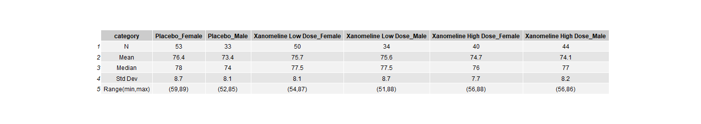

# Generate Summary Statistics

## How to use this document:

In this document you'll see code chunks (typically on a light grey background) and text. This is an example of an "Rmarkdown" document. You can write and run code within the document and the results will be presented underneath each code chunk. You should follow the instructions as written in the text, amending the code chunks, then running them to produce the outputs as instructed.

## Data Source
For these projects we are using anonymized CDISC datasets, which can be found here:
https://github.com/phuse-org/phuse-scripts/tree/master/data/adam/cdisc 

## R objects and functions

Within R we typically use objects of different types e.g. data, vectors, lists etc. and then we apply functions. Functions have the construct `<function_name>(<argument1>=   , <argument2> = )`. When you use functions, you don't ***have*** to use the argument name and instead you can implicitly refer to the arguments by position e.g. `myFunction(foo, 1, "bar")` passes in the R object `foo` as the value for argument 1; argument 2 takes the value `1` and argument 3 takes the character value `"bar"`. While you're learning R we recommend that you explicitly name and use the arguments in functions, except where functions only have one argument. You can use the tab-completion in the RStudio IDE to help complete function call arguments. To see the arguments of a function type `?<functionName>` in the Console.

## Start the mini project

# Build familiarity with R coding & generate summary statistics of continuous variables by Gender

In this project we are working towards creating a demography summary table like this one: .

## Aims:

-   Read in ADSL SAS (xpt) dataset

-   Subset for Efficacy Analysis Population

-   Calculate summary statistics within grouping variables

-   Transpose the resulting data to prepare for tabulation

In this MiniProject we recap use of the following functions (from MiniProject 1 & 2):

|          |          |             |
|----------|----------|-------------|
| library  | read_sas | filter      |
| group_by | mutate   | select      |
| round    | format   | pivot_wider |

and we introduce the following functions:

|           |              |         |
|-----------|--------------|---------|
| summarize | pivot_longer | ungroup |

1.  The following steps will load the packages `tidyverse` & `rio`. You need to load packages before using the functions and content in them, and it's best to do so at the beginning of a program / script. Run the chunk below by clicking on the green arrow to the right of the code chunk. To check what package repository you are using, run `.libPaths()` at the R Console.

```{r setup}
library(tidyverse)
library(rio)
```

2.   Read in the CDISC adsl data from the GitHub location (`https://github.com/phuse-org/phuse-scripts/raw/master/data/adam/cdisc/adsl.xpt`) and assign this to an object in R using the assignment operator `<-`. Make sure that the URL location is a character string by enclosing it in `" "`. The `rio` package has a function called `import` that reads data into R and infers the data type from the file name. The first argument of that function is `file`. Paste the file path / URL above after the `file=` argument in the code below, then run the chunk using the green arrow.

```{r create_adsl_saf}
adsl <- import( file = ""  )
adsl
```

Next filter the adsl dataset where the EFFFL variable has the value "Y" (as we did in previous MiniProjects). Add the appropriate code to the `filter` function to select only observations where the EFFFL is "Y". We will also recode the SEX variable to replace values where it is "M" with the value "Male" and where "F" recoding to "Female".

```{r create_adsl_saf}
adsl_eff <- adsl %>%
  filter(  ) %>%
  mutate(SEX = recode(SEX, "M" = "Male", "F" = "Female")) 
```

3.  Create a dataframe (age_mean) to hold the mean Age (Grouped by Treatment and Gender) needed for the demog table.

    Note: Age is a continuous variable.

In the R chunk below, we start with the `adsl_eff` dataset and calculate the mean AGE in each level of the variables specified (`TRT01AN, TRT01A, SEX`) in the `group_by()` function. We previously used `group_by` in exercise 3 from "MiniProject2.Rmd". `group_by()` works very much like the `BY . ;` statement in SAS - each action is performed **within the levels of the grouping variable**. `group_by()` also carries along any grouping variables, so if a variable is used in a `group_by()` statement it will also appear in the resulting dataset. If you need to "switch off" grouping, you should use the `ungroup()` function.

The {dplyr} package has a function called `summarize()` that will calculate various summary statistics. It is analogous to `PROC MEANS` in SAS. In the chunk below, we will create a new variable named "mean" that will hold the mean AGE at each level of the `group_by` variables. Add the specified by variables from above to the `group_by()` function in the code below, run the chunk, and observe the output from the `summarize()` function.

+----------------------------------------------------------------------------------------------------------------------------------------------------------------------------------------+
| **QUESTION**: If there are three treatment groups and two levels of SEX, how many rows will be in the resulting dataset if we `group_by()` using the variables `TRT01AN, TRT01A, SEX`? |
+----------------------------------------------------------------------------------------------------------------------------------------------------------------------------------------+

```{r}
adsl_eff %>%
  group_by(  ) %>% 
  summarize(mean =(mean(AGE)))
```

Notice that there are 5 decimal places outputted in the mean values. We do not often need that many, so we can use the round() function to round to one decimal place. We will also need to format the mean variable to character to match with any specified standards for reporting, and to allow us to append percentages for the final display; Using `format()` with the `nsmall` argument will accomplish the transition from numeric to character. See exercises 7-8 from MiniProject2.Rmd for a summary on the `round()` and `format()` functions. Run the chunk below to see the new mean variable with the appropriate formatting.

```{r}
adsl_eff %>%
  group_by( TRT01A, TRT01AN, SEX ) %>%
  summarize(mean = (mean( AGE ) %>% 
                      round(digits =  ) %>%
                      format(nsmall =  ))
  )
```

4.  Now that we have a good idea of how to generate means, we can now use the summarize() function to generate other summary statistics we need, including standard deviations, medians, ranges, and counts. The functions for each, respectively, are just as you would expect: `sd()`, `median()`, `min()`, `max()`, and `n()`.

Using the above information, finish the code below by creating a data frame named `age_stat` starting from the dataset `adsl_eff` that holds summary statistics. Create a standard deviation variable titled "sd", median titled "med", min titled "min", max titled "max", and a count variable titled "n" (count for whole dataset). Make sure to convert each variable to character with the format function, and specify 1 decimal place for sd and 0 for the rest.

```{r}
age_stat<- adsl_eff %>%
  group_by(TRT01AN,TRT01A,SEX) %>%
  summarize(mean = (mean( ) %>% round(digits = 1) %>% format(nsmall=1))  ,
            sd = (sd( ) %>% round(digits = 1) %>% format(nsmall = 1)), 
            med = median( )  ,              
            min = min( ), 
            max = max( ),
            n = n())

age_stat
```

5.  Since our output table includes ranges, we will need to combine the min and max value into a character string (as we did with counts and percentages in Mini Project 2). In the code chunk below, generate a data frame named `age_stat2`, and combine `min` and `max`?? in a new variable to get a Range statistic called range_minmax.

```{r}
age_stat %>%
    mutate(range_minmax=paste("(",min, ",", max, ")"))
```

Notice that there is a space between the first parentheses and the first digit. Please update the code below to eliminate the space. Refer back to exercise 9 from Mini Project 2.

```{r}
age_stat2<-age_stat %>%
  mutate(range_minmax= paste("(",min, ",", max, ")"))

age_stat2

```

6.  Transpose the summary statistics into a single variable of results.

-   Now that the group_by variables are no longer needed, we will use the `ungroup()` function to put the data back into its initial settings. Remember that If we do not `ungroup()` the data, the `select()` statement carries forward the assigned grouping variables.

Notice the difference in display when we look at `age_stat2` compared to the version where we `ungroup()`.

```{r}
age_stat2 

age_stat2 %>%
    ungroup()
```

At the minute, the `age_stat` data has one column for each summary statistic. But in our example table, we want to define columns by the treatment variables and also in this case by the `SEX` variable. To achieve this reformatting of the data we will pivot the data (i.e. transpose) to create a long-format dataset, with columns for the treatment variables `TRT01AN` and `TRT01A` and the grouping variable `SEX` (as before) but we will convert the columns of summary statistics to one column giving the statistic name and one column for the value of that statistic. We can then pivot (transpose) back into whatever format we wish to display the final table.

The `pivot_longer()` function will pivot (or transpose) the data from a "wide" format to a "long" format. The function has three key arguments: `cols` which tells R which columns to pivot (transpose), `names_to` which tells R the name of the new variable which holds the ***names*** of the pivoted variables, and `values_to` which tells R the name of the new variable which holds the ***values*** from the pivoted variables.

Using the `select()` function before `pivot_longer` will allow us to select just the variables we want to show in our pivoted, transposed data. Most of the time, we aren't going to want to transpose EVERY variable. We can define which columns to pivot (transpose) in three ways: we can name them explicitly, we can identify them by column or variable number, or we can use the `-<VARIABLE>` to tell R which variable to ***exclude*** from the pivot. If we wish to exclude more than one variable, we use the `c()` collection function to define a vector of variable names. In the code below, add the list of summary statistics we calculated above to the select function (excluding min and max, but including range).

Before we pivot (transpose) the data, we have to ensure that the columns we're about to pivot all have the same type. In the `age_stat2` data, the formatted values (`mean`, `sd`, `range_minmax`) are character, but `med` and `n` are still numeric. We do this by applying the `as.character()` function to any variables that meet the condition `is.numeric()`. Combining `mutate()` with `across()` applies the same function to each column variable that meets the condition.

-\> ***R for SAS users:*** The `select()` function works like a `keep;` statement in SAS.

```{r}
desc_stat_long <- age_stat2 %>%
  ungroup() %>%
  select("TRT01A","SEX", "n", "mean", "med", "sd", "range_minmax") %>% 
  mutate(across(where(is.numeric), .fns = as.character)) %>%
  pivot_longer(-c("TRT01A","SEX"), names_to ="category", values_to = "values" )

 desc_stat_long
```

7.  Now we can use the `pivot_wider()` function to transpose the `desc_stat_long` data, using the to match the Demographic table below:

.

Please see Exercise 13 from MiniProject2.Rmd for information on how to use `pivot_wider()`. (HINT: `pivot_wider()` and `pivot_longer()` are similar except that `pivot_longer()` tells R where column names and values are going ***to***, but `pivot_wider()` tells R where column names and values are coming ***from***. Try the code below, choosing different variables to use in `names_from` argument. See how the choices change the look of the resulting dataset, and choose the best representation to match the desired final table. If you need to use more than one variable to define columns you can use the `c()` function to collect the variables into a vector of variable names.

```{r}
desc_stat_long %>%
  pivot_wider(names_from = TRT01A, values_from = values)
```

8.  Generate the Final dataframe `agestat_cat` by renaming the `category` values to match the expected names within the table.

We can use the `case_when()` function within the `mutate()` function to vectorize multiple 'if' and 'else if' statements. The arguments contain a sequence of two-sided formulas. The left hand side (LHS) determines which values match this case. The right hand side (RHS) provides the replacement value.

-\> ***R for SAS users:*** The `case_when()` function works like a SQL 'CASE WHEN' statement in SAS.

```{r}
agestat_cat <- desc_stat_long %>%
  pivot_wider(names_from = c(TRT01A, SEX), values_from = values) %>%
  mutate(category = case_when(category == "n" ~ "N",
                              category == "med" ~ "Median", 
                              category == "mean" ~ "Mean", 
                              category == "sd" ~ "Std Dev", 
                              category == "range_minmax" ~ "Range(min,max)")) 

agestat_cat
```

------------------------------------------------------------------------

## Challenge 1: Get similar information for weight & Height.

(advs dataset in same GitHub as adsl)

To check that your code is reproducible, you will want to use the "knit" button on the RStudio IDE interface to create an HTML file based on your saved .Rmd file. If your code chunks are reproducible then you should get an HTML file as a result. If NOT (if there's an error or if the "knit" process fails) then click on the arrow to the right of the "Run" button and select "Restart R and Run All Chunks". Then troubleshoot which chunk is causing problems.

Save the .RMD file on your desktop and click on the "Knit" button at the top of the file to render an HTML version of this document.

### Extra credit / Top tip:

If you need to copy and paste code 3 times or more it's time to write a function. Functions in R are a bit like Macros in SAS.

You can quickly convert from code like this:

```{r}
age_stat<- adsl_saf %>%
  group_by(TRT01AN,TRT01A,SEX) %>%
  summarize(mean = mean( ) %>% round(digits = 1) %>% format(nsmall=1)  ,
            sd = sd( ) %>% round(digits = 1) %>% format(nsmall = 1), 
            med = median( )  ,              
            min = min( ), 
            max = max( ),
            n = n())

age_stat
```

To a function like this:

```{r}
varSummary <- function(adsl_saf, TRT01AN, TRT01A, SEX) {
  adsl_saf %>%
    group_by(TRT01AN,TRT01A,SEX) %>%
    summarize(mean = mean( ) %>% round(digits = 1) %>% format(nsmall=1)  ,
              sd = sd( ) %>% round(digits = 1) %>% format(nsmall = 1), 
              med = median( )  ,              
              min = min( ), 
              max = max( ),
              n = n())
}
```

using the "Extract function" in RStudio IDE's "Code" menu. You can then tidy this code to change the function arguments. You then want to abstract the code so that the user running the code has the ability to change the things that they need to change. This abstraction means that writing the code is a little more complex within the tidyverse - you need to refer to the variable within a dataset, and stop R from trying to find that variable as an object in your environment (top right tab in RStudio IDE).

Let's change the input data argument to .data to match what we see in {tidyverse} functions and add an argument that is the name of the variable in the dataset that we want to summarise. For now, let's assume that the function will summarise by `TRT01AN, TRT01A, SEX` regardless of which variable is being summarised:

```{r}
varSummary <- function(.data, variable) {
  .data %>%
    group_by(TRT01AN,TRT01A,SEX) %>%
    summarize(mean = mean(variable ) %>% round(digits = 1) %>% format(nsmall=1)  ,
              sd = sd(variable) %>% round(digits = 1) %>% format(nsmall = 1), 
              med = median(variable)  ,              
              min = min(variable ), 
              max = max(variable ),
              n = n())
}

adsl_saf %>%
  varSummary(AGE)
```

The problem here is that R is looking for an object called AGE, which doesn't exist in the current Environment. Instead we need to tell R that the "AGE" argument that we pass should be interpreted within the scope of the data, rather than looking in the Environment. The secret is to enclose or "embrace" the variable in double quotes within the function. It's a bit like using a Macro variable in SAS.

```{r}
varSummary <- function(.data = NULL, variable = NULL) {
  .data %>%
    group_by(TRT01AN,TRT01A,SEX) %>%
    summarize(mean = mean({{variable}}) %>% round(digits = 1) %>% format(nsmall=1)  ,
              sd = sd({{variable}}) %>% round(digits = 1) %>% format(nsmall = 1), 
              med = median({{variable}})  ,              
              min = min({{variable}}), 
              max = max({{variable}}),
              n = n())
}

adsl_saf %>%
  varSummary(AGE)
```
